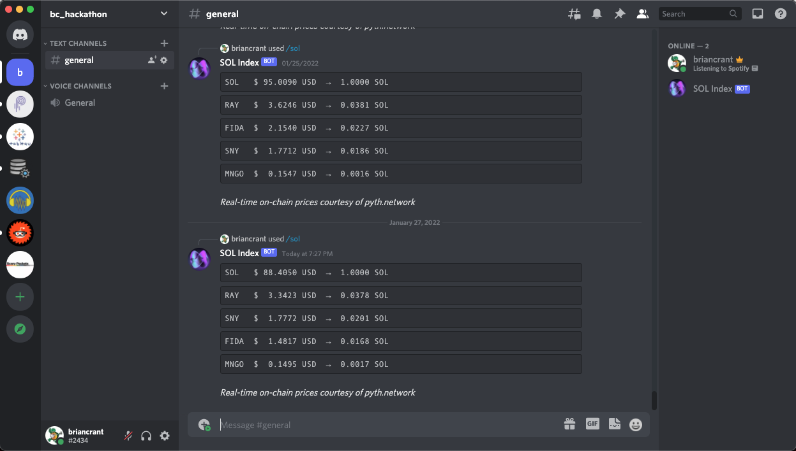
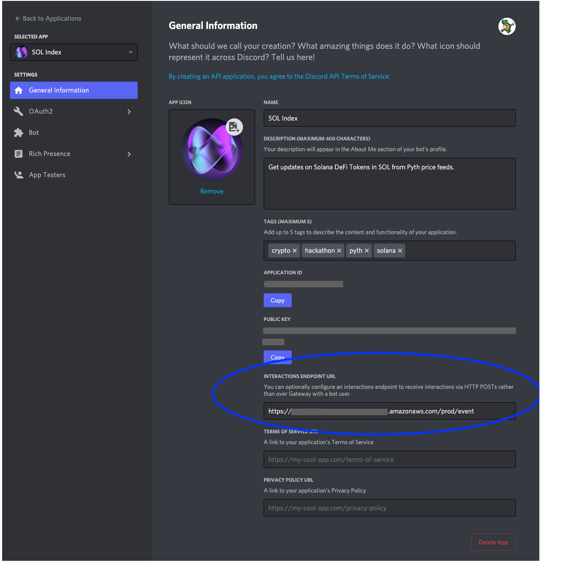

# Solana Index Discord

Receive price updates directly to your Discord Server by installing the bot and running `/sol` command.

  

Powered by `Pyth` ([Website](https://pyth.network/) | [Github](https://github.com/pyth-network)) on-chain price feeds, Solana Index Discord is an index of popular Solana DeFi Tokens, benchmarked to units of SOL. 




---- 

## Getting Started
This is ready to deploy as is, but if you want to build on top of it here is how you set up the environment. 

If you are looking for examples of working with `pyth-client-py` you can find that code [here](sol-idx/lambda/utils/pyth).

### Project Structure
```
sol-idx/
├── bin/
│   └── (Typescript Init AWS CDK)
│
├── lambda/
│   ├── index.py (Lambda Handler)
│   └── utils
│       ├── discord/
│       │   └── (Python logic)
│       ├── pyth/
│       │   └── (Python logic & helpers)
│       └── environment.py         
│
├── lambda-layer/
│   └── (Python Dependencies)
│
└── lib/
    └── (Typescript AWS Resources)
```


### Clone Repo   
`$ git clone https://github.com/bcrant/solana-index-discord.git`  

### Node
`$ nvm install --lts`  
`$ nvm use --lts`  
`$ node -v > .nvmrc`

### Python
`$ pyenv install 3.9.5`  
`$ pyenv virtualenv 3.9.5 solana_index`  
`$ pyenv local solana_index`  
`$ pip install --upgrade pip`  
`$ pip install -r ./sol-idx/lambda-layer/requirements.txt`  

### AWS CDK
Set up AWS CLI if you do not already. You can pass the CDK your AWS CLI profile for secrets.  

`$ npm install aws-cdk-lib`  
`$ npm install -g aws-cdk`  

To roll your own...  
`$ cdk bootstrap aws://{AWS_ACCOUNT_NUMBER}/{AWS_REGION}`  
`$ cdk init app --language typescript`  

To deploy as is...  
`$ cdk deploy --profile {AWS_PROFILE}`

For development, you may also find this useful...  
`$ cdk watch`

And the greatest feature ever created...  
`$ cdk destory`  

### Discord
1. [Create a Discord Bot](https://discord.com/developers/applications)

2. Give it the following permissions: `bot`, `activities.write`, `webhook.incoming`

3. Add it to your Discord Server

4. Add the API Gateway endpoint to your deployed project to the `Interactions Endpoint URL`:  

\



# License  
[](https://choosealicense.com/licenses/mit/)  


# Authors 
- Brian Crant &emsp;|&emsp; [LinkedIn](https://www.linkedin.com/in/briancrant/) 

Shouts out to [John McDonald](https://www.linkedin.com/in/john-mcdonald-dev/) for troubleshooting API Gateway with me on a Sunday.  

<br><br>
<figure>
    <a href="https://paypal.me/briancrant?locale.x=en_US"> 
        
    </a>
</figure>

<br><br>
